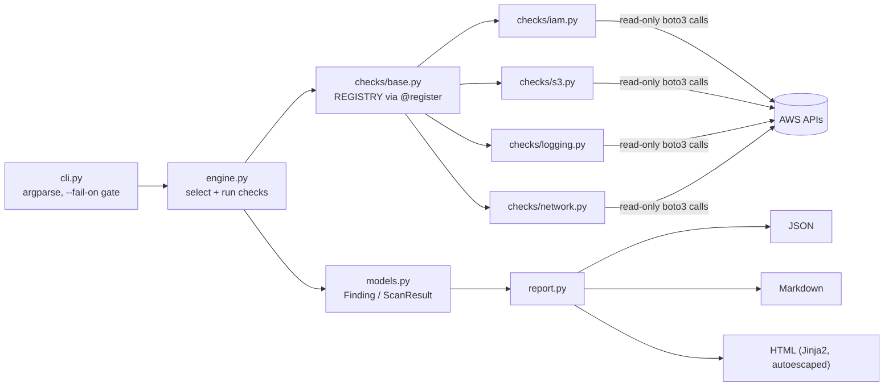

# AWS Cloud Security Posture Scanner

A read-only Python CLI that checks an AWS account against a focused subset of the
**CIS Amazon Web Services Foundations Benchmark** and produces JSON, Markdown, and
self-contained HTML reports.

It is a learning and portfolio project, not a replacement for AWS Security Hub,
Prowler, or ScoutSuite. The goal is a small, readable codebase where every control,
API call, and IAM permission is easy to audit.


## What it checks

| ID | Control | CIS ref | Severity | Scope |
|---|---|---|---|---|
| IAM-001 | Root account has MFA | 1.5 | CRITICAL | global |
| IAM-002 | No root access keys | 1.4 | CRITICAL | global |
| IAM-003 | Password policy: length >= 14, reuse prevention >= 24 | 1.8, 1.9 | MEDIUM | global |
| IAM-004 | Passwords / access keys unused > 90 days | 1.12 | MEDIUM | global |
| IAM-005 | No `AdministratorAccess` attached directly to users | 1.15, 1.16 | HIGH | global |
| S3-001 | Bucket-level Block Public Access (all four settings) | 2.1.4 | HIGH | global |
| S3-002 | Bucket default encryption configured | 2.1.1 (v1.4) | MEDIUM | global |
| LOG-001 | Multi-region CloudTrail logging with log file validation | 3.1, 3.2 | HIGH | global |
| LOG-002 | GuardDuty enabled | FSBP GuardDuty.1 (supplemental, not CIS) | MEDIUM | per region |
| NET-001 | No SG allows 0.0.0.0/0 or ::/0 to port 22 / 3389 | 5.2, 5.3 | HIGH | per region |
| EC2-001 | EBS encryption by default | 2.2.1 | MEDIUM | per region |
| KMS-001 | Rotation on customer-managed symmetric KMS keys | 3.6 | MEDIUM | per region |

CIS section numbers shift between benchmark versions; references here follow v1.4 / v1.5
numbering and should be verified against the version your organization uses. Severities
are this project's own judgment, not CIS-assigned.

## Architecture



- **Plugins**: each control is a `BaseCheck` subclass with `check_id`, `title`,
  `cis_ref`, `severity`, `remediation`, and a `run()` method returning `Finding`s.
- **Engine**: runs global checks once and regional checks once per `--regions` entry.
  A `ClientError` (for example `AccessDenied`) becomes an `ERROR` finding instead of
  aborting the scan, so missing permissions are visible in the report.
- **Reports**: findings sorted failures first, then by severity. The HTML report has
  no external assets and escapes all AWS-sourced strings.

## Usage

```bash
pip install -r requirements.txt

# list available checks
python -m scanner --list-checks

# scan with a named profile across two regions
python -m scanner --profile audit --regions us-east-1,us-west-2 --output reports

# only some checks, markdown only
python -m scanner --checks IAM-001,IAM-002,S3-001 --format md

# CI gate: exit code 2 if any HIGH or CRITICAL failure
python -m scanner --fail-on HIGH
```

Credentials come from the standard boto3 chain (env vars, `~/.aws`, SSO, instance role).
Output lands in `reports/posture-report.{json,md,html}`.

A sample run against a **moto-mocked** account (no real AWS involved) is in
[`examples/sample-report/`](examples/sample-report/); regenerate it with `make sample`.

## Development

```bash
make install   # dev deps: moto, pytest, ruff, bandit
make check     # ruff + bandit + pytest
```

Tests use [moto](https://github.com/getmoto/moto) to build compliant and
non-compliant fixtures in an in-memory AWS. Root-account state (MFA, root keys)
can't be set in moto, so those tests use a small fake IAM client for the
opposite case. `IAM-004` takes an injectable clock so "90 days unused" can be
tested without waiting 90 days.

## Adding a check

1. Pick a module in `scanner/checks/` (or create one and import it in
   `scanner/checks/__init__.py`).
2. Subclass `BaseCheck` and decorate with `@register`:

```python
@register
class RdsNotPublic(BaseCheck):
    check_id = "RDS-001"
    title = "RDS instances are not publicly accessible"
    cis_ref = "CIS 2.3.3"
    severity = Severity.HIGH
    regional = True
    remediation = "aws rds modify-db-instance --db-instance-identifier <id> --no-publicly-accessible"

    def run(self):
        rds = self.client("rds")
        out = []
        for db in rds.describe_db_instances()["DBInstances"]:
            rid = db["DBInstanceIdentifier"]
            if db["PubliclyAccessible"]:
                out.append(self.failed(rid, "Instance is publicly accessible."))
            else:
                out.append(self.passed(rid, "Not publicly accessible."))
        return out
```

3. Add the API action (`rds:DescribeDBInstances`) to
   `policies/scanner-readonly-policy.json`.
4. Add a moto test with one compliant and one non-compliant resource.
5. Update the registry-count assertion in `tests/test_engine_report.py`.

## Least-privilege design

- [`policies/scanner-readonly-policy.json`](policies/scanner-readonly-policy.json)
  lists exactly the 19 actions the checks call, all `Describe/Get/List` style.
  You can attach it instead of the broad AWS `SecurityAudit` managed policy.
- One exception worth knowing: `iam:GenerateCredentialReport` is technically a
  write-type action (it starts report generation) but changes no configuration.
- No action can modify resources, read object data (`s3:GetObject`), or decrypt
  (`kms:Decrypt`). `Resource: "*"` is required because these list/describe APIs
  don't support resource-level scoping.
- Recommended deployment: a dedicated role with this policy, assumed via SSO or
  OIDC from CI, rather than long-lived IAM user keys.
- Missing permissions degrade gracefully into `ERROR` findings.

## Limitations

- Single account; no AWS Organizations fan-out.
- S3 checks look at bucket-level Block Public Access only, not the account-level
  setting or bucket policies/ACLs.
- Since January 2023 AWS applies SSE-S3 to new buckets automatically, so S3-002
  will usually pass on real accounts; it is still useful for old buckets.
- Not every CIS control is implemented; see the table above.

## License

MIT - see [LICENSE](LICENSE).
